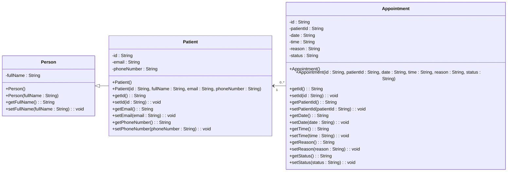
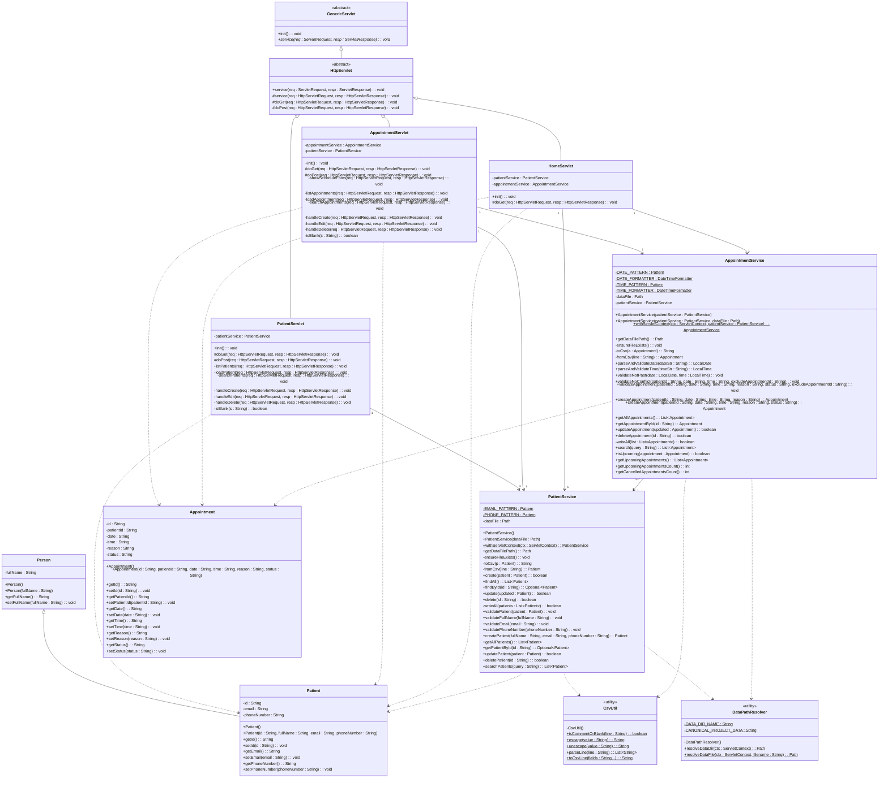

# MediCalendra – UML Class Diagrams

## 1. Domain Model and Object-Oriented Class Diagram

```mermaid
classDiagram
direction LR

class Person {
    -fullName : String
    +Person()
    +Person(fullName : String)
    +getFullName() : String
    +setFullName(fullName : String) : void
}

class Patient {
    -id : String
    -email : String
    -phoneNumber : String
    +Patient()
    +Patient(id : String, fullName : String, email : String, phoneNumber : String)
    +getId() : String
    +setId(id : String) : void
    +getEmail() : String
    +setEmail(email : String) : void
    +getPhoneNumber() : String
    +setPhoneNumber(phoneNumber : String) : void
}

class Appointment {
    -id : String
    -patientId : String
    -date : String
    -time : String
    -reason : String
    -status : String
    +Appointment()
    +Appointment(id : String, patientId : String, date : String, time : String, reason : String, status : String)
    +getId() : String
    +setId(id : String) : void
    +getPatientId() : String
    +setPatientId(patientId : String) : void
    +getDate() : String
    +setDate(date : String) : void
    +getTime() : String
    +setTime(time : String) : void
    +getReason() : String
    +setReason(reason : String) : void
    +getStatus() : String
    +setStatus(status : String) : void
}

%% INHERITANCE
Person <|-- Patient

%% IDENTIFIER-BASED DOMAIN ASSOCIATION
Patient "1" <-- "0..*" Appointment
```

## 2. Backend Layer Class Diagram

```mermaid
classDiagram
direction TB

class GenericServlet {
    <<abstract>>
    <<external Jakarta Servlet API>>
    +init() : void
    +service(req : ServletRequest, resp : ServletResponse) : void*
}

class HttpServlet {
    <<abstract>>
    <<external Jakarta Servlet API>>
    +service(req : ServletRequest, resp : ServletResponse) : void
    #service(req : HttpServletRequest, resp : HttpServletResponse) : void
    #doGet(req : HttpServletRequest, resp : HttpServletResponse) : void
    #doPost(req : HttpServletRequest, resp : HttpServletResponse) : void
}

class PatientServlet {
    -patientService : PatientService
    +init() : void
    #doGet(req : HttpServletRequest, resp : HttpServletResponse) : void
    #doPost(req : HttpServletRequest, resp : HttpServletResponse) : void
    -listPatients(req : HttpServletRequest, resp : HttpServletResponse) : void
    -loadPatient(req : HttpServletRequest, resp : HttpServletResponse) : void
    -searchPatients(req : HttpServletRequest, resp : HttpServletResponse) : void
    -handleCreate(req : HttpServletRequest, resp : HttpServletResponse) : void
    -handleEdit(req : HttpServletRequest, resp : HttpServletResponse) : void
    -handleDelete(req : HttpServletRequest, resp : HttpServletResponse) : void
    -isBlank(s : String) : boolean
}

class AppointmentServlet {
    -appointmentService : AppointmentService
    -patientService : PatientService
    +init() : void
    #doGet(req : HttpServletRequest, resp : HttpServletResponse) : void
    #doPost(req : HttpServletRequest, resp : HttpServletResponse) : void
    -showScheduleForm(req : HttpServletRequest, resp : HttpServletResponse) : void
    -listAppointments(req : HttpServletRequest, resp : HttpServletResponse) : void
    -loadAppointment(req : HttpServletRequest, resp : HttpServletResponse) : void
    -searchAppointments(req : HttpServletRequest, resp : HttpServletResponse) : void
    -handleCreate(req : HttpServletRequest, resp : HttpServletResponse) : void
    -handleEdit(req : HttpServletRequest, resp : HttpServletResponse) : void
    -handleDelete(req : HttpServletRequest, resp : HttpServletResponse) : void
    -isBlank(s : String) : boolean
}

class HomeServlet {
    -patientService : PatientService
    -appointmentService : AppointmentService
    +init() : void
    #doGet(req : HttpServletRequest, resp : HttpServletResponse) : void
}

class PatientService {
    -EMAIL_PATTERN : Pattern$
    -PHONE_PATTERN : Pattern$
    -dataFile : Path
    +PatientService()
    +PatientService(dataFile : Path)
    +withServletContext(ctx : ServletContext) : PatientService$
    +getDataFilePath() : Path
    -ensureFileExists() : void
    -toCsv(p : Patient) : String
    -fromCsv(line : String) : Patient
    +create(patient : Patient) : boolean
    +findAll() : List~Patient~
    +findById(id : String) : Optional~Patient~
    +update(updated : Patient) : boolean
    +delete(id : String) : boolean
    -writeAll(patients : List~Patient~) : boolean
    +validatePatient(patient : Patient) : void
    +validateFullName(fullName : String) : void
    +validateEmail(email : String) : void
    +validatePhoneNumber(phoneNumber : String) : void
    +createPatient(fullName : String, email : String, phoneNumber : String) : Patient
    +getAllPatients() : List~Patient~
    +getPatientById(id : String) : Optional~Patient~
    +updatePatient(patient : Patient) : boolean
    +deletePatient(id : String) : boolean
    +searchPatients(query : String) : List~Patient~
}

class AppointmentService {
    -DATE_PATTERN : Pattern$
    -DATE_FORMATTER : DateTimeFormatter$
    -TIME_PATTERN : Pattern$
    -TIME_FORMATTER : DateTimeFormatter$
    -dataFile : Path
    -patientService : PatientService
    +AppointmentService(patientService : PatientService)
    +AppointmentService(patientService : PatientService, dataFile : Path)
    +withServletContext(ctx : ServletContext, patientService : PatientService) : AppointmentService$
    +getDataFilePath() : Path
    -ensureFileExists() : void
    -toCsv(a : Appointment) : String
    -fromCsv(line : String) : Appointment
    +parseAndValidateDate(dateStr : String) : LocalDate
    +parseAndValidateTime(timeStr : String) : LocalTime
    +validateNotPast(date : LocalDate, time : LocalTime) : void
    +validateNoConflict(patientId : String, date : String, time : String, excludeAppointmentId : String) : void
    +validateAppointment(patientId : String, date : String, time : String, reason : String, status : String, excludeAppointmentId : String) : void
    +createAppointment(patientId : String, date : String, time : String, reason : String) : Appointment
    +createAppointment(patientId : String, date : String, time : String, reason : String, status : String) : Appointment
    +getAllAppointments() : List~Appointment~
    +getAppointmentById(id : String) : Appointment
    +updateAppointment(updated : Appointment) : boolean
    +deleteAppointment(id : String) : boolean
    -writeAll(list : List~Appointment~) : boolean
    +search(query : String) : List~Appointment~
    +isUpcoming(appointment : Appointment) : boolean
    +getUpcomingAppointments() : List~Appointment~
    +getUpcomingAppointmentsCount() : int
    +getCancelledAppointmentsCount() : int
}

class Person {
    -fullName : String
    +Person()
    +Person(fullName : String)
    +getFullName() : String
    +setFullName(fullName : String) : void
}

class Patient {
    -id : String
    -email : String
    -phoneNumber : String
    +Patient()
    +Patient(id : String, fullName : String, email : String, phoneNumber : String)
    +getId() : String
    +setId(id : String) : void
    +getEmail() : String
    +setEmail(email : String) : void
    +getPhoneNumber() : String
    +setPhoneNumber(phoneNumber : String) : void
}

class Appointment {
    -id : String
    -patientId : String
    -date : String
    -time : String
    -reason : String
    -status : String
    +Appointment()
    +Appointment(id : String, patientId : String, date : String, time : String, reason : String, status : String)
    +getId() : String
    +setId(id : String) : void
    +getPatientId() : String
    +setPatientId(patientId : String) : void
    +getDate() : String
    +setDate(date : String) : void
    +getTime() : String
    +setTime(time : String) : void
    +getReason() : String
    +setReason(reason : String) : void
    +getStatus() : String
    +setStatus(status : String) : void
}

class CsvUtil {
    <<utility>>
    -CsvUtil()
    +isCommentOrBlank(line : String) : boolean$
    +escape(value : String) : String$
    +unescape(value : String) : String$
    +parseLine(line : String) : List~String~$
    +toCsvLine(fields : String...) : String$
}

class DataPathResolver {
    <<utility>>
    -DATA_DIR_NAME : String$
    -CANONICAL_PROJECT_DATA : String$
    -DataPathResolver()
    +resolveDataDir(ctx : ServletContext) : Path$
    +resolveDataFile(ctx : ServletContext, filename : String) : Path$
}

%% INHERITANCE
GenericServlet <|-- HttpServlet
HttpServlet <|-- PatientServlet
HttpServlet <|-- AppointmentServlet
HttpServlet <|-- HomeServlet
Person <|-- Patient

%% ASSOCIATIONS WITH MULTIPLICITY
PatientServlet "1" --> "1" PatientService
AppointmentServlet "1" --> "1" AppointmentService
AppointmentServlet "1" --> "1" PatientService
HomeServlet "1" --> "1" PatientService
HomeServlet "1" --> "1" AppointmentService
AppointmentService "0..*" --> "1" PatientService

%% DEPENDENCIES
PatientServlet ..> Patient
AppointmentServlet ..> Patient
AppointmentServlet ..> Appointment
HomeServlet ..> Patient
HomeServlet ..> Appointment
PatientService ..> Patient
AppointmentService ..> Appointment
PatientService ..> CsvUtil
AppointmentService ..> CsvUtil
PatientService ..> DataPathResolver
AppointmentService ..> DataPathResolver
```
